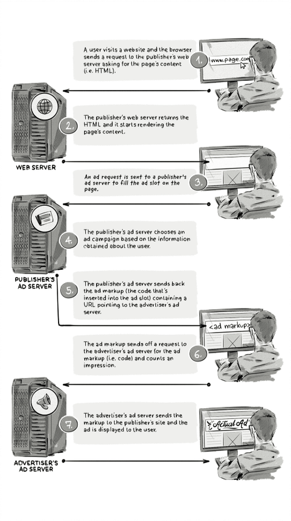

+++
title = "Ad server | Рекламный сервер"
+++

# Ad server
## Рекламный сервер

&nbsp;

Рекламный сервер — это технологическая платформа, которая отвечает за принятие решений о том, какие объявления показывать на сайте, их доставку, а также сбор и отчётность данных (показы, клики и т.д.).

Рекламные серверы стали одними из первых технологических решений в индустрии онлайн-рекламы и до сих пор активно используются как рекламодателями, так и издателями.

### Типы рекламных серверов:

- First-party ad server. Используется издателями для заполнения рекламных слотов на своём сайте. Он выбирает объявления из прямых кампаний, аукционов в реальном времени (RTB) и других процессов медиазакупок. Его основная задача — максимизировать доход от рекламного инвентаря, показывая наиболее релевантные объявления.

- Third-party ad server. Используется рекламодателями для отслеживания эффективности всей кампании на всех издательских площадках в единой системе. Он измеряет охват кампании, учитывает пересечение аудитории между разными издателями и проверяет отчёты, предоставленные издателями.

### Основные функции рекламного сервера:

- **Принятие решений**: Выбор наиболее подходящего объявления для показа на основе данных о пользователе, контенте страницы и условиях кампании.
- **Доставка объявлений**: Обеспечение корректного отображения рекламы в нужном месте и в нужное время.
- **Сбор данных**: Отслеживание показов, кликов, конверсий и других метрик для анализа эффективности кампании.
- **Отчётность**: Предоставление детализированных отчётов для рекламодателей и издателей.

Рекламные серверы играют ключевую роль в экосистеме цифровой рекламы, обеспечивая прозрачность, контроль и эффективность рекламных кампаний. Они помогают рекламодателям оптимизировать свои бюджеты, а издателям — максимизировать доходы от рекламного инвентаря.

