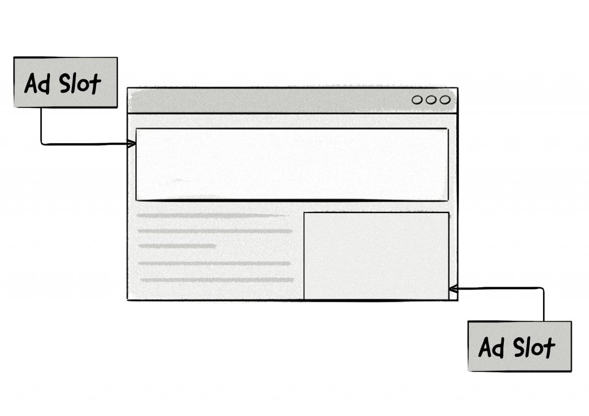

+++
title = "Ad slot | Рекламный слот"
+++

# Ad slot
## Рекламный слот

&nbsp;

Рекламный слот — это конкретное место на веб-странице, где отображается реклама.

Чтобы загрузить рекламу на страницу, в рекламный слот помещается специальный тег (ad tag), который взаимодействует с [рекламным сервером](ad-server/) и определяет, какие именно креативы будут показаны.

Издатели (площадки) размещают рекламные слоты в определённых частях веб-страницы, где они хотят показывать рекламу. Это может быть верхняя часть страницы (header), боковая панель (sidebar), или, например, область внутри контента. Таким образом, слот — это «окно», через которое реклама попадает к пользователю, а его расположение и размер играют ключевую роль в эффективности рекламной кампании.

