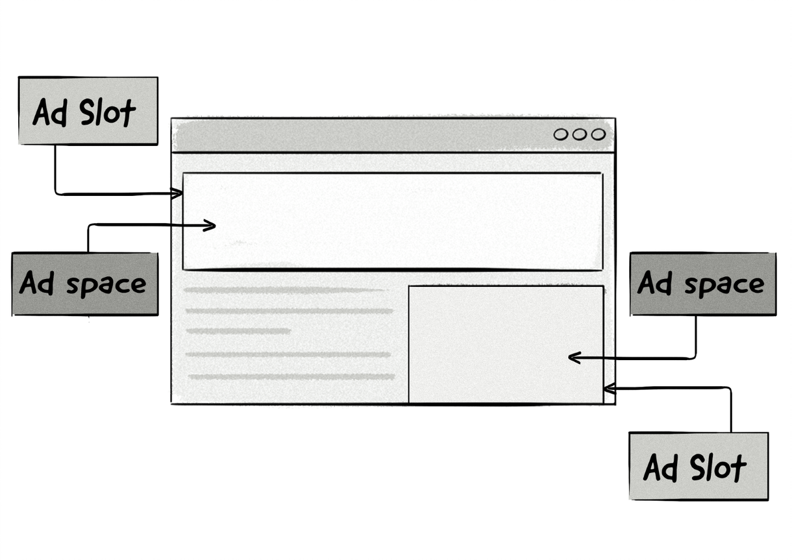

+++
title = "Ad space | Рекламное пространство"
+++

# Ad space
## Рекламное пространство

&nbsp;

Рекламное пространство — это область, которую занимает реклама внутри рекламного слота ([ad slot](/glossaries/glossary/ad-slot-definition/)).

Хотя термины «рекламное пространство» и «[рекламный слот](/glossaries/glossary/ad-slot-definition/)» часто используются как синонимы, они имеют разные значения.

Чтобы проиллюстрировать это, представьте себе билборд. Металлическая конструкция и рамка — это рекламный слот, а белое поле внутри рамки, где размещается реклама, — это и есть рекламное пространство. Другими словами, слот — это «контейнер», а пространство — это место, где непосредственно отображается рекламное сообщение.

