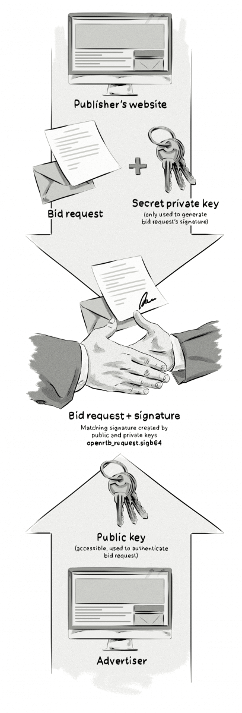

+++
title = "Ads.cert | Авторизованные цифровые продавцы"
+++

# Ads.cert

&nbsp;

**Также известен как**: authorized digital sellers, авторизованные цифровые продавцы

Ads.cert — это инициатива, разработанная IAB (Interactive Advertising Bureau), направленная на снижение определённых видов рекламного мошенничества и арбитража.

Это улучшенная версия другого проекта IAB — ads.txt, который также борется с мошенничеством и повышает прозрачность в процессе программатик-закупок рекламы.

Ads.cert вводит криптографически подписанные запросы на участие в аукционах (bid requests), что позволяет аутентифицировать рекламный инвентарь издателя. Это даёт покупателям возможность отслеживать путь инвентаря и убедиться, что они приобретают рекламу только у авторизованных продавцов.

### Как это работает:

- **Цифровая подпись**: Каждый запрос на участие в аукционе подписывается с использованием криптографических методов, что делает его подлинность проверяемой.
- **Аутентификация**: Покупатели могут проверить, что инвентарь действительно принадлежит заявленному издателю и продаётся через авторизованные каналы.
- **Прозрачность**: Вся цепочка поставки рекламы становится более прозрачной, что снижает риск мошенничества, такого как поддельные сайты или несанкционированная перепродажа инвентаря.

Таким образом, ads.cert дополняет ads.txt, добавляя дополнительный уровень безопасности и доверия в экосистему программатик-рекламы. Это особенно важно для борьбы с такими видами мошенничества, как поддельные запросы на участие в аукционах (bid spoofing) и несанкционированная перепродажа рекламного инвентаря.

