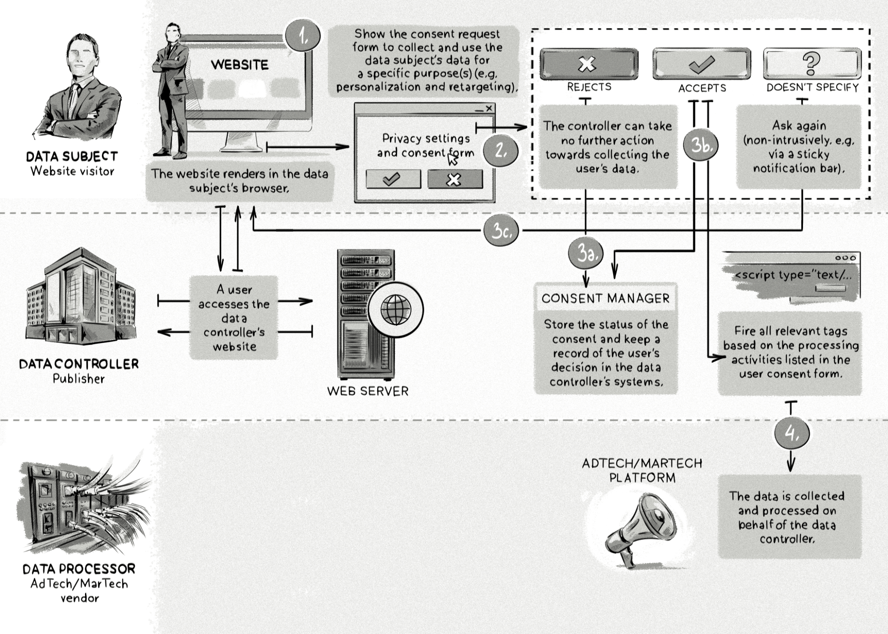

+++
title = "Content-delivery network (CDN) | Сеть доставки контента"
+++

# Consent-management platform (CMP)
## Платформа управления согласиями 

&nbsp;

Платформа управления согласиями (CMP) — это инструмент, который помогает сайтам соблюдать нормативные требования по сбору согласий пользователей. CMP предоставляет техническую возможность информировать посетителей о типах собираемых данных и запрашивать их согласие на определённые цели обработки данных.

### Как это работает:
- Когда пользователь заходит на сайт, CMP отображает баннер или всплывающее окно с информацией о:
    - Типах данных, которые собираются (например, cookies, IP-адрес).
    - Целях обработки данных (например, таргетинг рекламы, аналитика).

- Пользователь может:
    - Дать согласие на все цели обработки данных.
    - Выбрать только определённые цели.
    - Отказаться от сбора данных.

CMP сохраняет выбор пользователя и обеспечивает его соблюдение.

### Преимущества CMP:
- **Соответствие нормативным требованиям**: Помогает соблюдать законы, такие как GDPR (Общий регламент по защите данных) в ЕС или CCPA (Калифорнийский закон о конфиденциальности).
- **Прозрачность**: Увеличивает доверие пользователей, предоставляя им контроль над своими данными.
- **Гибкость**: Позволяет настраивать запросы согласия в зависимости от региона или типа пользователя.

### Основные функции CMP:
- **Отображение баннеров согласия**: Информирование пользователей о сборе данных.
- **Управление предпочтениями**: Возможность для пользователей изменять свои настройки.
- **Интеграция с AdTech**: Передача информации о согласиях в рекламные платформы и системы аналитики.

### Пример использования:
- Пользователь из ЕС заходит на сайт и видит баннер: «Мы используем cookies для улучшения вашего опыта. Вы можете согласиться или настроить предпочтения».
- Пользователь выбирает, какие типы cookies разрешить (например, только необходимые).
- CMP сохраняет его выбор и обеспечивает соблюдение этих предпочтений.

CMP — это важный инструмент для соблюдения законов о конфиденциальности и повышения доверия пользователей, что особенно важно в эпоху усиленного внимания к защите данных.

