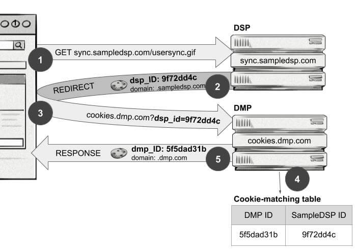

+++
title = "Cookie syncing | Синхронизация cookie"
+++

# Cookie syncing
## Синхронизация cookie

&nbsp;

**Также известна как**: cookie matching, cookie mapping, ID syncing, ID matching, user-ID mapping

Синхронизация cookie — это процесс обмена идентификаторами пользователей, хранящимися в [cookie](/glossaries/glossary/cookie/), между различными платформами для обмена информацией о пользователе. Основная цель синхронизации cookie — улучшить таргетинг рекламы.

### Как это работает:
- Пользователь посещает сайт, и на его устройство записывается cookie с уникальным идентификатором.
- Этот идентификатор передаётся другим платформам (например, DSP, SSP, Ad Exchange) через процесс синхронизации.
- Платформы сопоставляют идентификаторы, чтобы создать единый профиль пользователя.
- На основе этого профиля рекламодатели могут показывать более релевантную рекламу.

### Пример:
- Пользователь посещает сайт A, где ему присваивается идентификатор «123».
- Сайт A синхронизирует этот идентификатор с платформой B, которая также знает этого пользователя под идентификатором «456».
- Теперь платформа B может использовать данные сайта A для улучшения [таргетинга рекламы](/glossaries/glossary/ad-targeting/).

### Преимущества синхронизации cookie:
- **Улучшение таргетинга**: Более точное определение интересов и поведения пользователя.
- **Повышение эффективности кампаний**: Реклама становится более релевантной, что увеличивает CTR и конверсии.
- **Интеграция данных**: Объединение информации из разных источников для создания единого профиля пользователя.

### Проблемы синхронизации cookie:
- **Конфиденциальность**: Сбор и обмен данными о пользователях могут вызывать вопросы о защите приватности.
- **Технические ограничения**: Блокировка cookie браузерами и мобильными устройствами.

### Когда используется синхронизация cookie:
- Для программатик-рекламы, где важно точное таргетинг.
- Для кросс-платформенного отслеживания пользователей.

Синхронизация cookie — это важный инструмент в цифровой рекламе, который помогает рекламодателям лучше понимать свою аудиторию и показывать более релевантные объявления.

