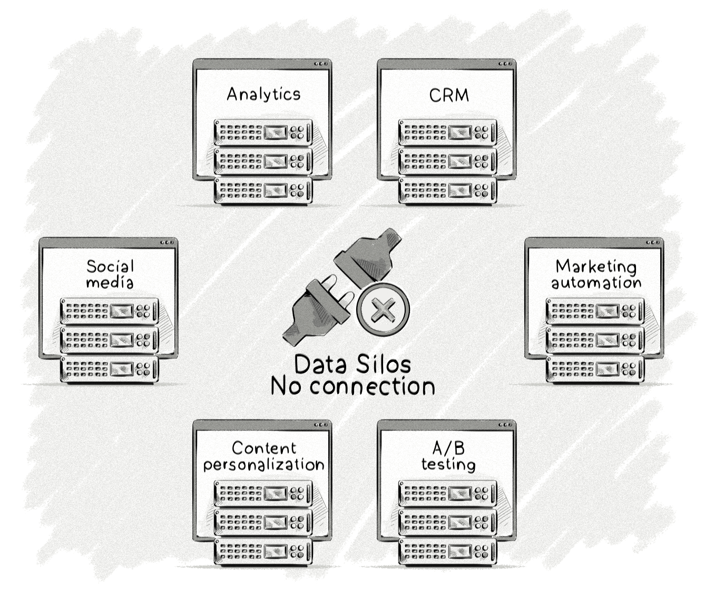

+++
title = "Customer-data platform (CDP) | Платформа данных о клиентах"
+++

# Customer-data platform (CDP)
## Платформа данных о клиентах

&nbsp;

Платформа данных о клиентах (CDP) — это маркетинговая технология, которая собирает и организует данные из различных онлайн- и оффлайн-источников.

### Основные функции CDP:
- Сбор данных:
    - **Онлайн-источники**: сайты, мобильные приложения, электронная почта, социальные сети.
    - **Оффлайн-источники**: CRM-системы, данные о покупках в магазинах, call-центры.
- Организация данных:
    - Создание единого профиля клиента (Single Customer View).
    - Объединение данных из разных каналов взаимодействия.
- Аналитика и сегментация:
    - Генерация аналитических отчётов.
    - Создание аудиторий и сегментов для таргетинга.
- Интеграция с другими системами:
    - Экспорт данных в рекламные платформы (DSP, SSP), системы email-маркетинга, CRM и другие инструменты.

### Преимущества CDP:
- **Единый взгляд на клиента**: Возможность видеть полную историю взаимодействий клиента с брендом.
- **Персонализация**: Улучшение рекламных и маркетинговых кампаний за счёт точного таргетинга.
- **Автоматизация**: Упрощение процессов сбора и анализа данных.

### Пример использования:
Компания собирает данные о клиентах из интернет-магазина, мобильного приложения и оффлайн-магазинов. CDP объединяет эти данные, создавая единый профиль для каждого клиента. Маркетологи используют эту информацию для:
- Сегментации аудитории (например, «частые покупатели» или «клиенты, которые давно не совершали покупок»).
- Персонализированных email-рассылок.
- Таргетинга рекламы на основе поведения клиентов.

CDP — это мощный инструмент для современных маркетологов, который помогает лучше понимать клиентов, улучшать их опыт и повышать эффективность маркетинговых кампаний.

