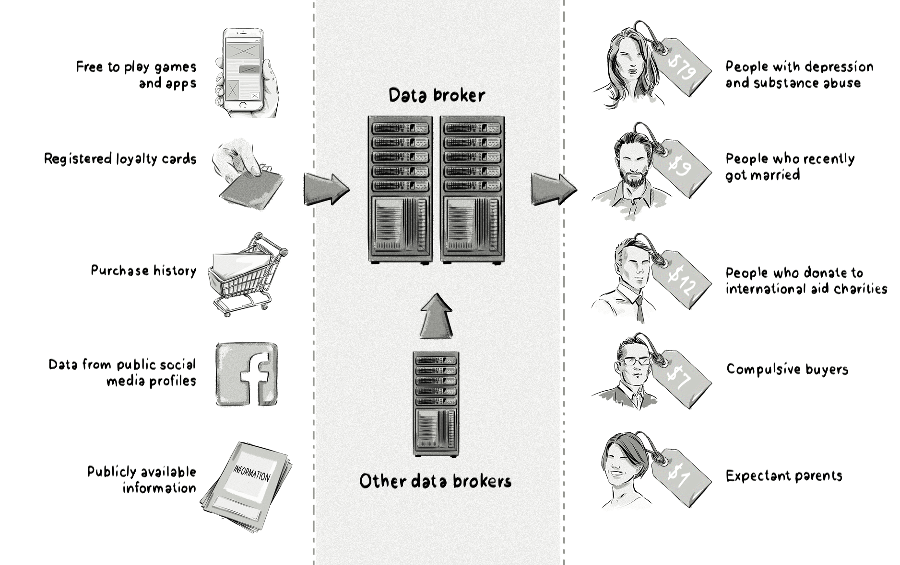

+++
title = "Data broker | Брокер данных"
+++

# Data broker
## Брокер данных

&nbsp;

**Также известен как**: data provider, data supplier, поставщик данных, провайдер данных  

Брокер данных — это компания, которая собирает данные о пользователях из различных источников и продаёт их рекламным платформам, таким как [платформы управления данными (DMP)](/glossaries/glossary/data-management-platform-dmp/) и [платформы для закупки (DSP)](/glossaries/glossary/demand-side-platform-dsp/).  

### Как это работает:  
- **Сбор данных**:  
   - **Прямой сбор**: Использование тегов на веб-страницах, отслеживание поведения пользователей.  
   - **Покупка данных**: Приобретение данных у других компаний (например, кредитных организаций, розничных сетей).  
- **Агрегация данных**: Объединение данных из разных источников для создания подробных профилей пользователей.  
- **Продажа данных**: Предоставление данных рекламным платформам для улучшения таргетинга и персонализации.  

### Примеры данных, собираемых брокерами:  
- Демографические данные (возраст, пол, доход).  
- Данные о поведении (посещённые сайты, поисковые запросы).  
- Данные о покупках (история транзакций, предпочтения).  

### Применение в рекламе:  
- **Таргетинг**: Рекламодатели используют данные для показа релевантной рекламы.  
- **Сегментация аудитории**: Создание целевых групп на основе данных.  
- **Персонализация**: Настройка контента и рекламы под интересы пользователей.  

### Пример использования:  
- Брокер данных собирает информацию о пользователях, которые часто покупают товары для дома.  
- Эти данные продаются рекламодателю, который продвигает мебель и товары для интерьера.  
- Рекламодатель использует данные для таргетинга рекламы на эту аудиторию.  

### Преимущества использования данных от брокеров:  
- **Точность**: Возможность показывать рекламу наиболее заинтересованной аудитории.  
- **Эффективность**: Увеличение CTR и конверсий за счёт точного таргетинга.  
- **Гибкость**: Доступ к данным, которые сложно собрать самостоятельно.  

### Проблемы:  
- **Конфиденциальность**: Сбор и продажа данных могут вызывать вопросы о защите приватности.  
- **Точность**: Данные могут быть устаревшими или неточными.  

Брокеры данных играют важную роль в экосистеме цифровой рекламы, предоставляя рекламодателям доступ к ценным данным для улучшения таргетинга и персонализации.

