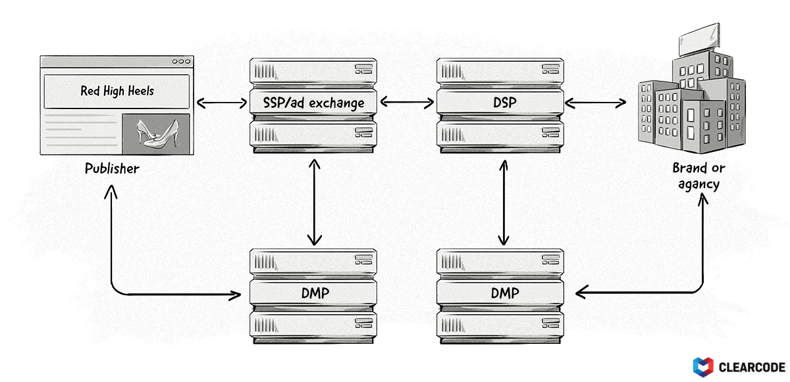

+++
title = "Data-management platform (DMP) | Платформа управления данными"
+++

# Data-management platform (DMP)
## Платформа управления данными

&nbsp;

Платформа управления данными (DMP) — это специализированная платформа, которая собирает и интегрирует данные первого, второго и третьего уровня из различных источников, чтобы сделать их пригодными для использования рекламодателями.  

### Основные функции DMP:  
- **Сбор данных**:  
   - **Данные первого уровня (First-party data)**: Данные, собранные непосредственно сайтом или приложением (например, поведение пользователей, регистрационные данные).  
   - **Данные второго уровня (Second-party data)**: Данные, полученные от партнёров (например, другие сайты или бренды).  
   - **Данные третьего уровня (Third-party data)**: Данные, приобретённые у сторонних поставщиков (например, демографические данные, интересы).  
- **Интеграция данных**: Объединение данных из разных источников для создания единого профиля пользователя.  
- **Сегментация аудитории**: Создание целевых групп на основе данных (например, «молодые мамы», «любители путешествий»).  
- **Активация данных**: Использование данных для таргетинга рекламы, персонализации контента и аналитики.  

### Пример использования:  
- Рекламодатель собирает данные о пользователях, которые посещают его сайт и добавляют товары в корзину.  
- DMP объединяет эти данные с демографической информацией от стороннего поставщика.  
- На основе этих данных создаётся [сегмент аудитории](/glossaries/glossary/audience-segment/) «потенциальные покупатели», который используется для ретаргетинга.  

### Преимущества DMP:  
- **Точный [таргетинг](/glossaries/glossary/ad-targeting/)**: Возможность показывать релевантную рекламу на основе полных данных.  
- **Персонализация**: Настройка контента и рекламы под интересы пользователей.  
- **Эффективность кампаний**: Увеличение ROI за счёт более точного использования данных.  

### Применение в AdTech:  
- **Рекламодатели**: Использование данных для таргетинга и оптимизации кампаний.  
- **Издатели**: Монетизация данных через продажу рекламного инвентаря.  

DMP — это ключевой инструмент для работы с данными, который помогает рекламодателям и издателям повышать эффективность своих кампаний и улучшать пользовательский опыт.

