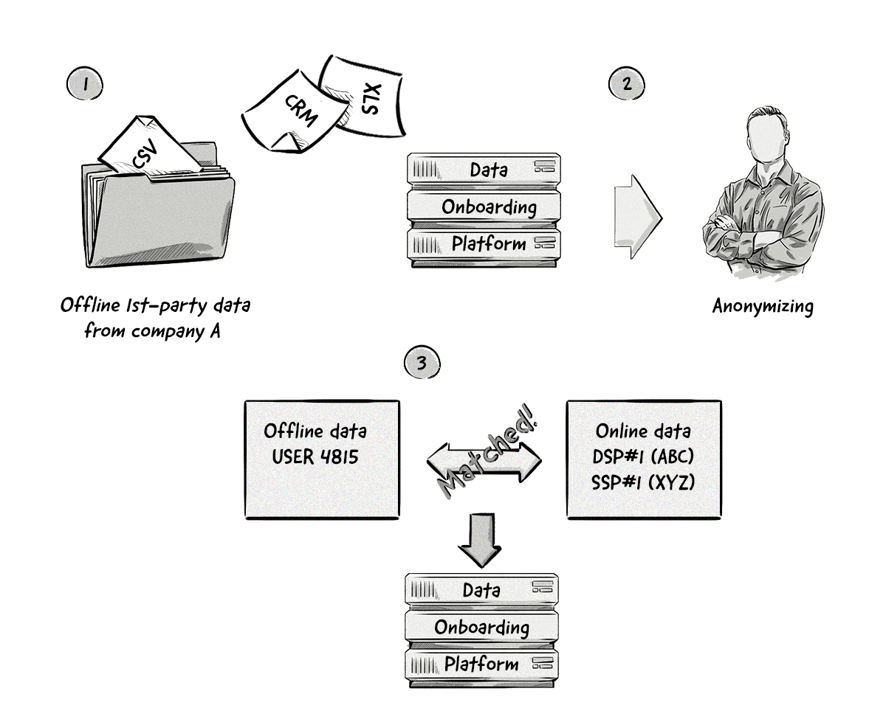

+++
title = "Data onboarding | Интеграция данных"
+++

# Data onboarding
## Интеграция данных

&nbsp;

 
**Также известна как**: интеграция данных первого уровня (first-party data onboarding)  

Интеграция данных — это процесс объединения оффлайн-данных о клиентах с онлайн-данными для создания полных профилей аудитории.  

### Как это работает:  
- **Сбор оффлайн-данных**: Информация о клиентах, собранная через CRM-системы, опросы, оффлайн-покупки и т.д.  
- **Сбор онлайн-данных**: Данные о поведении пользователей на сайте, в приложениях или через рекламные платформы.  
- **Сопоставление данных**: Использование уникальных идентификаторов (например, email, телефон) для объединения оффлайн- и онлайн-данных.  
- **Создание аудиторных сегментов**: Формирование целевых групп на основе объединённых данных.  

### Пример:  
- Пользователь совершил покупку в оффлайн-магазине, оставив свои данные (email, телефон).  
- Эти данные сопоставляются с онлайн-активностью пользователя (например, посещение сайта, клики по рекламе).  
- На основе этих данных создаётся сегмент аудитории для таргетинга рекламы.  

### Преимущества интеграции данных:  
- **Полный профиль клиента**: Объединение данных позволяет лучше понимать поведение и предпочтения пользователей.  
- **Точный таргетинг**: Возможность показывать релевантную рекламу на основе полных данных.  
- **Улучшение ROI**: Более эффективное использование рекламного бюджета за счёт точного таргетинга.  

### Применение в рекламе:  
- **Ретаргетинг**: Показ рекламы пользователям, которые уже взаимодействовали с брендом.  
- **Персонализация**: Настройка рекламы под конкретные интересы и поведение пользователей.  
- **Аналитика**: Более точное измерение эффективности кампаний.  

### Проблемы:  
- **Конфиденциальность**: Сбор и объединение данных могут вызывать вопросы о защите приватности.  
- **Точность**: Не все данные могут быть корректно сопоставлены.  

Интеграция данных — это мощный инструмент для рекламодателей, который помогает создавать более точные аудиторные сегменты и повышать эффективность рекламных кампаний.

