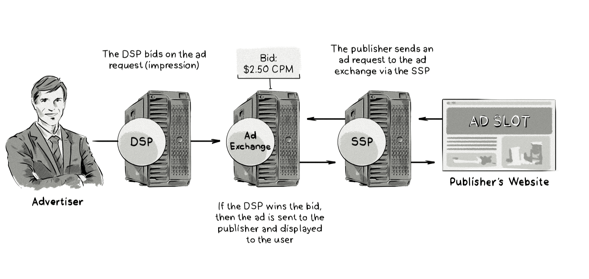

+++
title = "Demand-side platform (DSP) | Платформа для покупателей инвентаря"
+++

# Demand-side platform (DSP)
## Платформа для покупателей инвентаря

&nbsp;

**Также известна как**: Demand-side platform, DSP.  

[AdTech](/glossaries/glossary/adtech/)-платформа для покупателей рекламы (DSP) — это технологическая платформа, которая позволяет агентствам и рекламодателям покупать рекламный инвентарь у платформ для продажи рекламы ([Supply-Side Platform, SSP](/glossaries/glossary/supply-side-platform-ssp/)) и рекламных бирж ([Ad Exchange](/glossaries/glossary/ad-exchange/)).  

### Как это работает:  
- Рекламодатель настраивает кампанию в DSP, указывая:  
   - Целевую аудиторию (например, возраст, пол, интересы).  
   - Бюджет и стратегию ставок.  
   - Форматы и креативы.  
- Когда пользователь заходит на сайт или в приложение, SSP или биржа отправляют запрос на участие в аукционе (bid request) в DSP.  
- DSP анализирует запрос и делает ставку в режиме реального времени ([Real-Time Bidding, RTB](/glossaries/glossary/real-time-bidding-rtb/)).  
- Если ставка выигрывает, рекламное объявление показывается пользователю.  

### Основные функции DSP:  
- **Таргетинг**: Точный выбор целевой аудитории на основе данных о пользователе.  
- **Управление ставками**: Автоматическое участие в аукционах RTB.  
- **Аналитика**: Отслеживание эффективности кампаний (CTR, конверсии, ROI).  
- **Интеграция**: Подключение к различным SSP, биржам и источникам данных.  

### Пример использования:  
- Рекламодатель хочет продвигать новый продукт среди молодых мам.  
- В DSP настраивается кампания с таргетингом на женщин 25-35 лет, интересующихся детскими товарами.  
- DSP автоматически участвует в аукционах и показывает рекламу только целевой аудитории.  

### Преимущества DSP:  
- **Автоматизация**: Упрощение процесса закупки рекламного инвентаря.  
- **Точность**: Возможность точно таргетировать аудиторию.  
- **Прозрачность**: Полный контроль над бюджетом и эффективностью кампаний.  

DSP — это ключевой инструмент в программатик-рекламе, который помогает рекламодателям эффективно управлять своими кампаниями и достигать маркетинговых целей.

