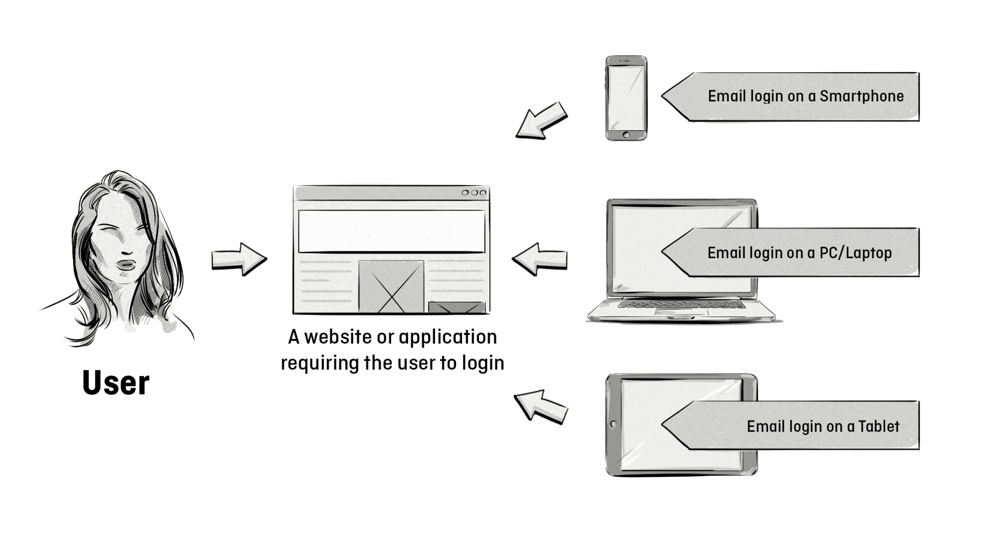

+++
title = "Deterministic matching | Детерминированное сопоставление"
+++

# Deterministic matching
## Детерминированное сопоставление

&nbsp;

Детерминированное сопоставление — это процесс идентификации одного и того же пользователя на разных устройствах с помощью уникального и постоянного идентификатора, такого как email-адрес.  

### Как это работает:  
- Пользователь регистрируется на платформе (например, Facebook, Google) с использованием email-адреса.  
- Этот email-адрес становится уникальным идентификатором, который связывает действия пользователя на разных устройствах (смартфон, планшет, ноутбук).  
- Платформа использует этот идентификатор для создания единого профиля пользователя.  

### Преимущества детерминированного сопоставления:  
- **Точность**: Высокая точность идентификации пользователя благодаря уникальному идентификатору.  
- **Кросс-устройственный таргетинг**: Возможность показывать рекламу пользователю на всех его устройствах.  
- **Улучшение аналитики**: Более точное измерение конверсий и взаимодействий.  
- **Персонализация**: Возможность предлагать более релевантный контент и рекламу.  

### Пример использования:  
- Пользователь ищет товар на ноутбуке, но не совершает покупку.  
- Позже он видит рекламу этого товара на своём смартфоне благодаря детерминированному сопоставлению.  

### Применение в [AdTech](/glossaries/glossary/adtech-platform/):  
- **[Таргетинг рекламы](/glossaries/glossary/ad-targeting/)**: Показ релевантной рекламы на всех устройствах пользователя.  
- **[Атрибуция](/glossaries/glossary/attribution/)**: Точное определение, какие каналы и устройства привели к конверсии.  
- **Аналитика**: Создание единого профиля пользователя для анализа поведения.  

### Проблемы детерминированного сопоставления:  
- **Конфиденциальность**: Сбор и использование данных о пользователях могут вызывать вопросы о защите приватности.  
- **Ограничения**: Требует регистрации пользователя, что может быть не всегда возможно.  

Детерминированное сопоставление — это мощный инструмент для улучшения таргетинга, аналитики и атрибуции, который помогает [рекламодателям](/glossaries/glossary/advertiser/) и [издателям](/glossaries/glossary/publisher/) лучше понимать свою аудиторию.

