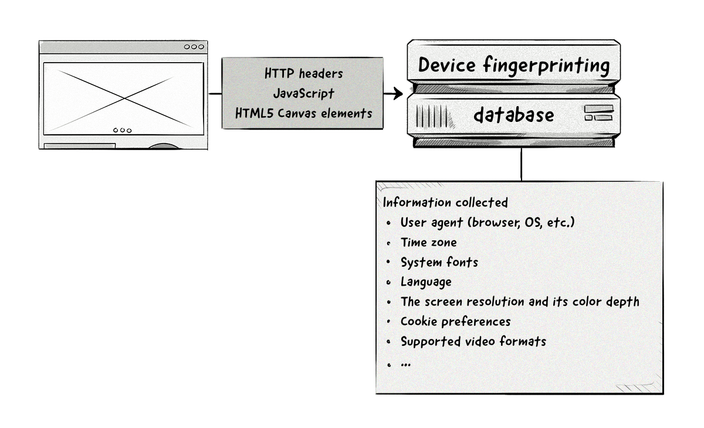

+++
title = "Device fingerprinting | Создание цифрового отпечатка устройства"
+++

# Device fingerprinting
## Создание цифрового отпечатка устройства

&nbsp;

**Также известен как**: canvas fingerprinting, browser fingerprinting, machine fingerprinting, фингерпринт

Создание цифрового отпечатка устройства — это процесс идентификации устройства или браузера на основе его уникальной конфигурации.  

### Как это работает:  
- Собираются данные о характеристиках устройства и браузера, такие как:  
   - Версия браузера и операционной системы.  
   - Установленные плагины и шрифты.  
   - Разрешение экрана и настройки языка.  
   - Аппаратные характеристики (например, тип процессора).  
- Эти данные объединяются в уникальный «отпечаток», который сохраняется на сервере.  
- Отпечаток используется для идентификации устройства при последующих посещениях.  

### Преимущества цифрового отпечатка устройства:  
- **Точность**: Уникальная комбинация характеристик делает отпечаток практически неповторимым.  
- **Устойчивость к блокировке**: В отличие от cookies, отпечаток нельзя легко удалить или заблокировать.  
- **Применение**: Используется для аналитики, таргетинга рекламы и атрибуции.  

### Пример использования:  
- Пользователь заходит на сайт с разных устройств.  
- С помощью цифрового отпечатка система определяет, что это один и тот же пользователь, и показывает ему релевантную рекламу.  

### Применение в AdTech:  
- **Аналитика**: Отслеживание поведения пользователя на сайте.  
- **[Таргетинг рекламы](/glossaries/glossary/ad-targeting/)**: Показ релевантных объявлений на основе данных об устройстве.  
- **[Атрибуция](/glossaries/glossary/attribution/)**: Определение, какие устройства и каналы привели к конверсии.  

### Проблемы цифрового отпечатка устройства:  
- **Конфиденциальность**: Сбор данных о устройстве может вызывать вопросы о защите приватности.  
- **Точность**: Некоторые устройства могут иметь схожие характеристики, что затрудняет идентификацию.  

Цифровой отпечаток устройства — это мощный инструмент для идентификации пользователей, который помогает рекламодателям и издателям улучшать таргетинг и аналитику.

