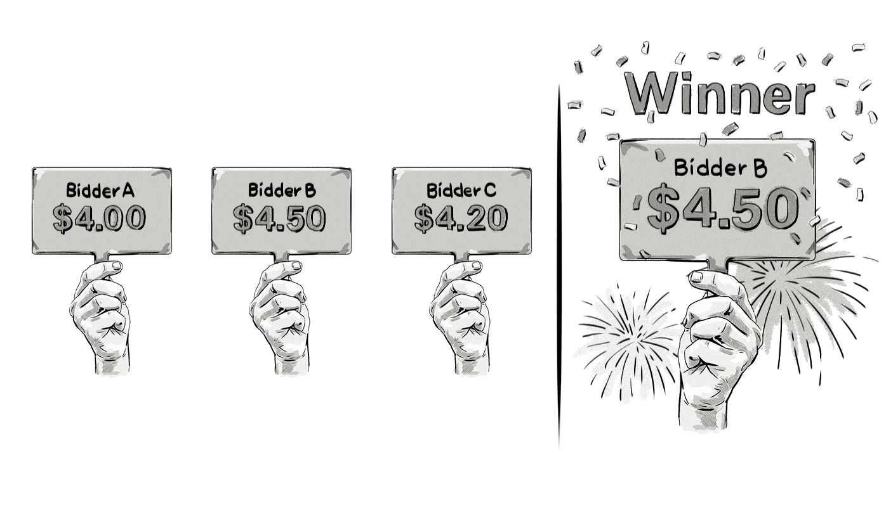

+++
title = "First-price auctions | Аукцион первой цены"
+++

# First-price auctions
## Аукцион первой цены

&nbsp;

 
В модели аукциона первой цены (также известного как английский аукцион) победитель платит ровно ту сумму, которую он предложил.  

### Как это работает:  
- Участники аукциона делают свои ставки.  
- Победителем становится участник с самой высокой ставкой.  
- Победитель платит сумму своей ставки.  

### Пример:  
- Участник A предлагает $4,00.  
- Участник B предлагает $4,50.  
- Участник C предлагает $4,20.  
- Победителем становится участник B, который платит $4,50.  

### Преимущества аукциона первой цены:  
- **Простота**: Понятные правила и прозрачный процесс.  
- **Мотивация к точным ставкам**: Участники стремятся предложить реальную ценность, чтобы не переплачивать.  

### Недостатки:  
- **Риск переплаты**: Победитель платит полную сумму своей ставки, даже если следующая по величине ставка была значительно ниже.  
- **Сложность для участников**: Требуется точный расчёт ставки, чтобы не переплатить.  

### Применение в AdTech:  
- В программатик-рекламе аукционы первой цены используются для продажи рекламного инвентаря.  
- Рекламодатели делают ставки за показы, и победитель платит полную сумму своей ставки.  

Аукцион первой цены — это простая и прозрачная модель, которая широко используется в различных сферах, включая цифровую рекламу.

