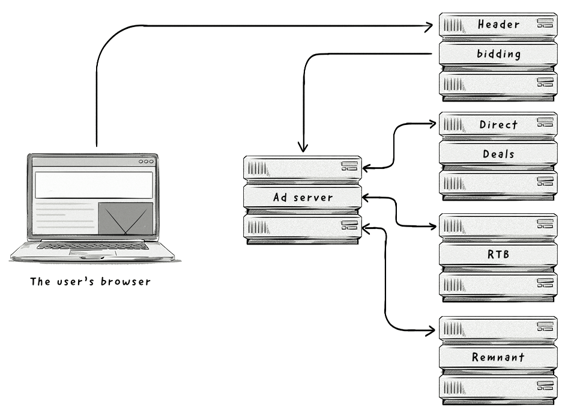

+++
title = "Header bidding"
+++

# Header bidding (HB)

&nbsp;

Header Bidding — это процесс, используемый издателями для одновременного сбора ставок от нескольких источников спроса (например, [DSP](/glossaries/glossary/demand-side-platform-dsp/), [рекламных сетей](/glossaries/glossary/ad-network/) через [SSP](/glossaries/glossary/supply-side-platform-ssp/) и [рекламные биржи](/glossaries/glossary/ad-exchange/)).  

### Как это работает:  
- [Издатель](/glossaries/glossary/publisher/) добавляет специальный тег (wrapper) в заголовок (header) своего сайта.  
- Когда пользователь заходит на сайт, тег отправляет запросы на участие в аукционе нескольким SSP, DSP и биржам одновременно.  
- Каждый источник спроса возвращает свою ставку.  
- [Издатель](/glossaries/glossary/publisher/) выбирает самую высокую ставку и передаёт её в свой рекламный сервер для показа объявления.  

### Преимущества Header Bidding:  
- **Максимизация доходов**: Издатель получает самую высокую [ставку](/glossaries/glossary/cost-per-mille-cpm-effective-cost-per-mille-ecpm/) за свой инвентарь.  
- **Конкуренция**: Рекламодатели могут конкурировать за [премиальный инвентарь](/glossaries/glossary/premium-inventory/), который обычно продаётся через прямые сделки.  
- **Прозрачность**: Издатель видит все ставки, что позволяет принимать более обоснованные решения.  

### Пример использования:  
- Издатель подключает Header Bidding через SSP A, SSP B и Ad Exchange.  
- SSP A предлагает $5 CPM, SSP B — $4,50 CPM, Ad Exchange — $4,80 CPM.  
- Издатель выбирает SSP A с самой высокой ставкой и показывает объявление.  

### Преимущества для рекламодателей:  
- **Доступ к премиальному инвентарю**: Возможность покупать инвентарь, который обычно недоступен через программатик.  
- **Конкурентоспособность**: Увеличение шансов на победу в аукционе.  

### Преимущества для издателей:  
- **Увеличение доходов**: Получение максимальной цены за инвентарь.  
- **Гибкость**: Возможность подключения множества источников спроса.  

Header Bidding — это мощный инструмент для издателей, который помогает максимизировать доходы от рекламного инвентаря и повышать конкуренцию среди рекламодателей.

