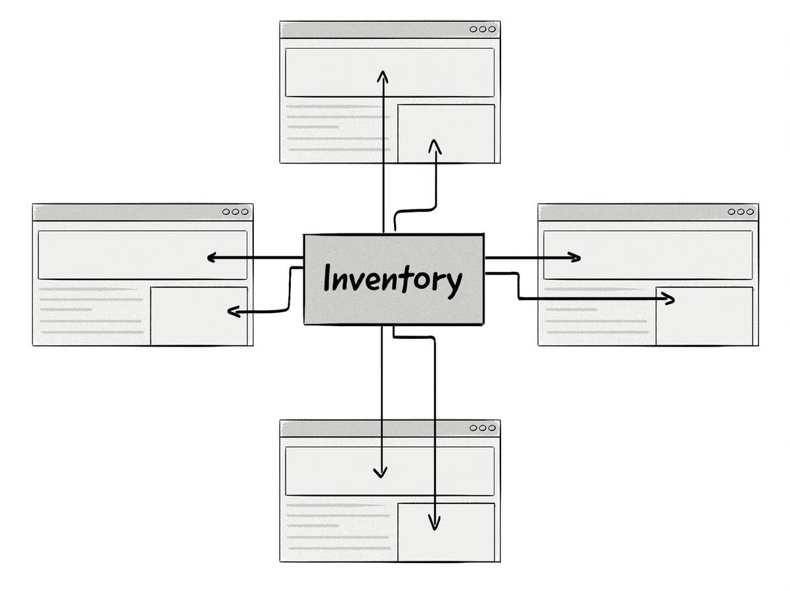

+++
title = "Inventory | Рекламный инвентарь"
+++

# Inventory
## Рекламный инвентарь

&nbsp;

Рекламный инвентарь — это термин, который обозначает все доступные рекламные [места на сайте](/glossaries/glossary/ad-space-definition/). Иногда термины «инвентарь» и «рекламное пространство» используются как синонимы.  

### Категории рекламного инвентаря:  
- **Премиальный инвентарь ([Premium Inventory](/glossaries/glossary/premium-inventory/))**:  
   - Самый ценный инвентарь, обычно на сайтах известных издателей.  
   - Высокий трафик и видимость (например, верхняя часть страницы).  
   - Продаётся через прямые сделки по высокой цене.  
- **Остаточный инвентарь ([Remnant Inventory](/glossaries/glossary/remnant-inventory/))**:  
   - Инвентарь, который не был продан через прямые сделки.  
   - Обычно продаётся по более низкой цене через рекламные сети или биржи.  
- **Длинный хвост (Long-Tail Inventory)**:  
   - Инвентарь на сайтах с низким трафиком (например, нишевые блоги).  
   - Основная платформа для монетизации — Google AdSense, но издатели также могут использовать партнёрские программы и другие рекламные сети.  

### Примеры:  
- **Премиальный инвентарь**: Рекламное место на главной странице крупного новостного сайта.  
- **Остаточный инвентарь**: Рекламное место на внутренних страницах, которое не было продано напрямую.  
- **Длинный хвост**: Рекламное место на блоге с узкой тематикой и небольшим трафиком.  

### Преимущества управления инвентарём:  
- **Максимизация доходов**: Продажа инвентаря по оптимальной цене.  
- **Гибкость**: Использование разных каналов монетизации (прямые сделки, программатик, сети).  
- **Эффективность**: Улучшение заполняемости инвентаря.  

Рекламный инвентарь — это ключевой актив издателя, который требует грамотного управления для максимизации доходов и эффективности.

