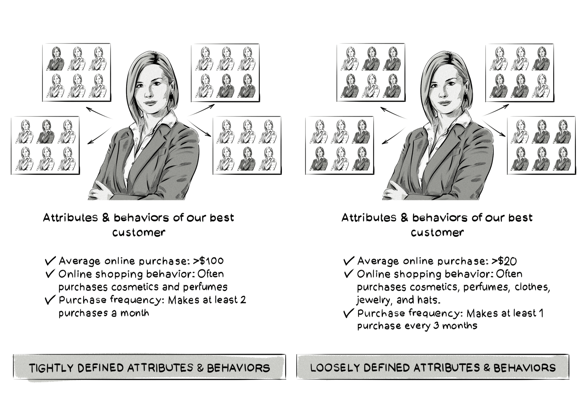

+++
title = "Look-alike modeling | Моделирование похожей аудитории"
+++

# Look-alike modeling
## Моделирование похожей аудитории

&nbsp;

Моделирование похожей аудитории — это процесс поиска групп людей, которые похожи на лучших и самых прибыльных клиентов бренда или рекламодателя по своим характеристикам и поведению.  

### Как это работает:  
- **Анализ данных**: Изучение данных о лучших клиентах (например, демография, интересы, поведение).  
- **Создание модели**: Использование алгоритмов машинного обучения для поиска похожих пользователей.  
- **Таргетинг**: Показ рекламы новой аудитории, которая похожа на лучших клиентов.  

### Пример:  
- Лучшие клиенты интернет-магазина: женщины 25-35 лет, которые покупают косметику и парфюмерию на сумму более $100 два раза в месяц.  
- С помощью Look-Alike Modeling магазин находит новых пользователей с похожими характеристиками и показывает им рекламу.  

### Преимущества Look-Alike Modeling:  
- **Расширение аудитории**: Возможность привлечения новых клиентов, похожих на лучших.  
- **Эффективность кампаний**: Увеличение ROI за счёт таргетинга на релевантную аудиторию.  
- **Персонализация**: Реклама становится более релевантной для новых пользователей.  

### Как используется в рекламе:  
- **Социальные сети**: Facebook, Instagram и другие платформы предлагают инструменты для создания Look-Alike аудиторий.  
- **Программатик-реклама**: DSP используют Look-Alike модели для таргетинга на похожих пользователей.  
- **Аналитика**: Поиск новых сегментов аудитории для улучшения маркетинговых стратегий.  

### Пример использования:  
- Рекламодатель анализирует данные о своих лучших клиентах (например, частые покупатели).  
- На основе этих данных создаётся Look-Alike аудитория.  
- Реклама показывается новой аудитории, что увеличивает вероятность конверсий.  

Look-Alike Modeling — это мощный инструмент для расширения аудитории и повышения эффективности рекламных кампаний, который помогает брендам находить новых клиентов, похожих на их лучших покупателей.

