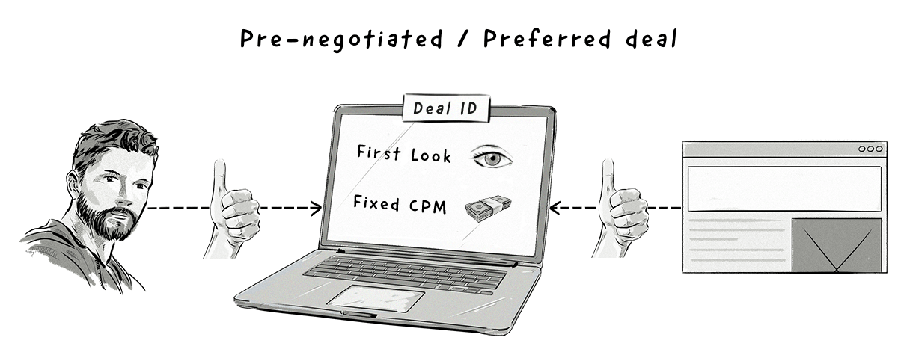

+++
title = "Private marketplace | Приватный маркетплейс"
+++

# Private marketplace
## Приватный маркетплейс

&nbsp;

Приватный маркетплейс (PMP) — это закрытая версия модели RTB (Real-Time Bidding), в которой участвует только ограниченное количество приглашённых рекламодателей.

С помощью PMP рекламодатели резервируют или гарантируют свою рекламу до того, как издатель разместит ее на общедоступной торговой площадке RTB.

### Как это работает:  
- **Приглашение**: Издатель приглашает выбранных рекламодателей для участия в аукционе.  
- **Аукцион**: Рекламодатели делают ставки на премиальный инвентарь издателя.  
- **Резервирование**: Рекламодатели могут заранее резервировать инвентарь, чтобы гарантировать показы.  

### Преимущества PMP:  
- **Премиальный инвентарь**: Доступ к высококачественному инвентарю, который обычно не продаётся через открытые аукционы.  
- **Контроль**: Издатель может выбирать, какие рекламодатели участвуют в аукционе.  
- **Прозрачность**: Чёткие условия и возможность отслеживания эффективности.  

### Сравнение с открытым RTB:  
- **Открытый RTB**: Участвуют все желающие рекламодатели.  
- **PMP**: Участвуют только приглашённые рекламодатели.  

### Пример использования:  
- Издатель предлагает рекламодателям участвовать в PMP для покупки инвентаря на главной странице сайта.  
- Рекламодатели делают ставки, и победитель получает доступ к премиальному инвентарю.  

PMP — это эффективный способ для издателей монетизировать свой премиальный инвентарь, а для рекламодателей — получить доступ к высококачественным рекламным местам.

