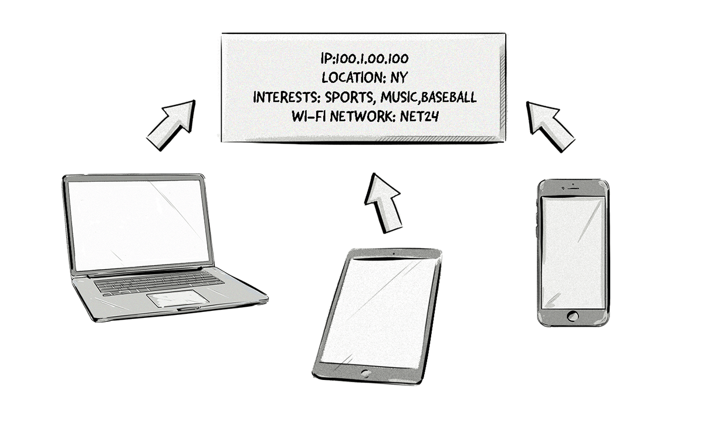

+++
title = "Probabilistic matching | Вероятностное сопоставление"
+++

# Probabilistic matching
## Вероятностное сопоставление

&nbsp;

Вероятностное сопоставление — это метод, который использует различные наборы данных и алгоритмы для идентификации (с высокой вероятностью) одного и того же пользователя на разных устройствах и приложениях.

Поскольку каждое устройство имеет свой собственный уникальный идентификатор (например, идентификатор устройства и файлы cookie), трудно определить, является ли это один и тот же пользователь на всех этих устройствах.

Вероятностное сопоставление используется в тех случаях, когда невозможно использовать детерминированное сопоставление, например, когда нет общего идентификатора, связывающего одного пользователя с несколькими устройствами (например, с электронной почтой или учетной записью в социальных сетях). Оно также может использоваться в сочетании с детерминированным сопоставлением для повышения числа совпадений и расширения профилей пользователей.

### Как это работает:  
- **Сбор данных**: Данные о поведении пользователя на разных устройствах (например, IP-адрес, браузер, местоположение).  
- **Анализ**: Использование алгоритмов для определения вероятности того, что данные принадлежат одному пользователю.  
- **Сопоставление**: Создание единого профиля пользователя на основе вероятностных данных.  

### Пример:  
- Пользователь использует смартфон и ноутбук для посещения сайтов.  
- На основе данных (IP-адрес, время активности, интересы) система определяет, что это, вероятно, один и тот же пользователь.  

### Преимущества вероятностного сопоставления:  
- **Широкий охват**: Возможность идентифицировать пользователей даже без уникальных идентификаторов.  
- **Гибкость**: Использование в случаях, когда детерминированное сопоставление невозможно.  
- **Улучшение данных**: Дополнение профилей пользователей новыми данными.  

### Сравнение с детерминированным сопоставлением:  
- **Детерминированное сопоставление**: Использование уникальных идентификаторов (например, email, телефон).  
- **Вероятностное сопоставление**: Использование алгоритмов для определения вероятности совпадения.  

### Пример использования:  
- Рекламодатель хочет показывать рекламу пользователю на всех его устройствах.  
- Если детерминированное сопоставление невозможно (например, пользователь не авторизован), используется вероятностное сопоставление.  
- На основе данных (IP-адрес, поведение) система определяет, что это, вероятно, один и тот же пользователь, и показывает релевантную рекламу.  

Вероятностное сопоставление — это важный инструмент для кросс-устройственного таргетинга, который помогает рекламодателям лучше понимать свою аудиторию и повышать эффективность кампаний.

