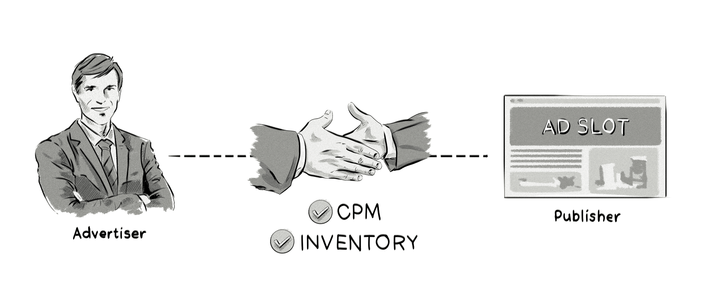

+++
title = "Programmatic direct | Программатик-прямые сделки"
+++

# Programmatic direct
## Программатик-прямые сделки

&nbsp;

Программатик-прямые сделки — это процесс медиазакупок, при котором [издатель](/glossaries/glossary/publisher/) и рекламодатель договариваются о покупке рекламного инвентаря напрямую, без аукциона, на основе фиксированной [цены за 1000 показов (CPM)](/glossaries/glossary/cost-per-mille-cpm-effective-cost-per-mille-ecpm/). Это очень похоже приватный маркетплейс([Private marketplace](/glossaries/glossary/private-marketplace/) (PMP))

### Как это работает:  
- **Переговоры**: Издатель и рекламодатель договариваются об условиях сделки (например, фиксированная цена, объёмы показов).  
- **Резервирование инвентаря**: Издатель резервирует определённый инвентарь для рекламодателя.  
- **Автоматизация доставки**: Реклама доставляется через программатик-платформы, что упрощает процесс и обеспечивает прозрачность.  

### Пример:  
- Рекламодатель договаривается с издателем о показе 100 000 баннеров на главной странице сайта за фиксированную цену $5 CPM.  
- Реклама доставляется через программатик-платформу, что позволяет отслеживать показы и эффективность.  

### Преимущества программатик-прямых сделок:  
- **Гарантированный инвентарь**: Рекламодатель получает доступ к премиальному инвентарю.  
- **Прозрачность**: Чёткие условия сделки и возможность отслеживания эффективности.  
- **Автоматизация**: Упрощение процесса доставки и отчётности.  

### Сравнение с Private Marketplace (PMP):  
- **[PMP](/glossaries/glossary/private-marketplace/)**: Аукцион, где несколько рекламодателей могут делать ставки на инвентарь.  
- **Programmatic Direct**: Фиксированная цена и резервирование инвентаря без аукциона.  

### Пример использования:  
- Рекламодатель хочет гарантированно показывать рекламу на главной странице популярного новостного сайта.  
- Стороны договариваются о фиксированной цене и объёмах показов.  
- Реклама доставляется через программатик-платформу, что обеспечивает прозрачность и контроль.  

Программатик-прямые сделки — это гибридный подход, который сочетает преимущества прямых сделок с автоматизацией и прозрачностью программатик-рекламы.

