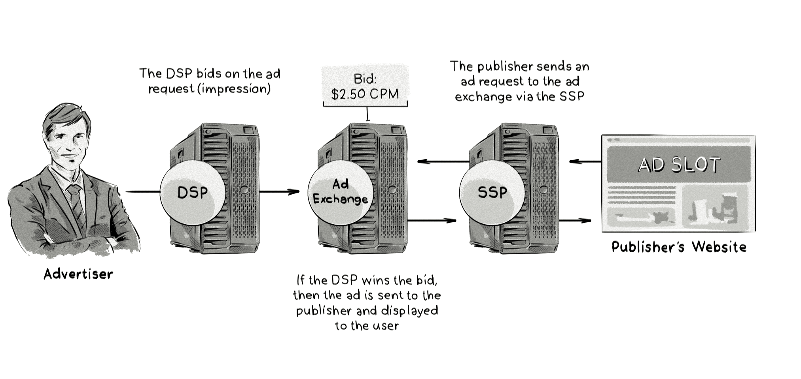

+++
title = "Real-time bidding (RTB)"
+++

# Real-time bidding (RTB)

&nbsp;

Real-Time Bidding (RTB) — это процесс покупки и продажи цифрового рекламного пространства через аукционы, которые происходят в режиме реального времени за время загрузки веб-страницы.  

### Как это работает:  
- Пользователь заходит на сайт или в приложение.  
- [Supply-side platform (SSP)](/glossaries/glossary/supply-side-platform-ssp/) или [рекламная биржа](/glossaries/glossary/ad-exchange/) отправляет запрос на участие в аукционе (bid request) в DSP.  
- [Demand-side platform (DSP)](/glossaries/glossary/demand-side-platform-dsp/) анализирует запрос и делает ставку (bid response) на основе данных о пользователе и критериях кампании.  
- Победитель аукциона получает возможность показать своё объявление.  

### Пример:  
- Пользователь заходит на новостной сайт.  
- SSP отправляет запрос на аукцион, и DSP рекламодателя делает ставку $3 CPM.  
- Если ставка выигрывает, рекламное объявление показывается пользователю.  

### Преимущества RTB:  
- **Скорость**: Весь процесс занимает менее 200 миллисекунд.  
- **Точность**: Возможность показывать релевантную рекламу на основе данных о пользователе.  
- **Эффективность**: Увеличение ROI за счёт оптимизации ставок в реальном времени.  

### Пример использования:  
- Рекламодатель использует DSP для участия в аукционах RTB.  
- Платформа автоматически делает ставки на основе данных о пользователе (например, интересы, поведение).  
- Рекламное объявление показывается только тем пользователям, которые соответствуют критериям кампании.  

### Сравнение с традиционной закупкой:  
- **Традиционная закупка**: Покупка рекламного пространства заранее по фиксированной цене.  
- **RTB**: Покупка инвентаря в режиме реального времени на основе аукционов.  

RTB — это ключевой элемент программатик-рекламы, который позволяет рекламодателям эффективно управлять своими бюджетами и показывать релевантную рекламу целевой аудитории.

