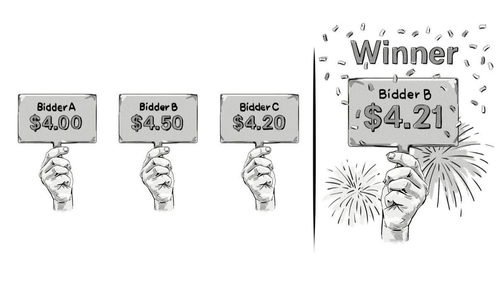

+++
title = "Second-price auction | Аукцион второй цены"
+++

# Second-price auction
## Аукцион второй цены

&nbsp;

Это тип аукциона, где победитель платит не свою максимальную ставку, а цену, равную второй по величине ставке плюс $0,01.

Модель аукциона второй цены активно используется в мире программатик-рекламы. Уже много лет она позволяет рекламодателям делать высокие ставки, чтобы гарантированно получить показы, но в итоге платить значительно меньшую сумму.

Это как стратегический ход: вы можете быть уверены, что ваша реклама будет показана, но при этом не переплачиваете. Такой подход выгоден всем: рекламодатели экономят, а издатели получают справедливую цену за свои рекламные ресурсы.

