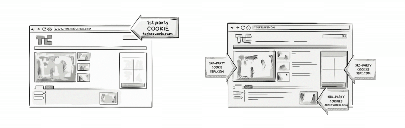

+++
title = "Third-party cookie | Сторонние куки"
+++

# Third-party cookie
## Сторонние куки 

&nbsp;

Это куки, которые сохраняются в домене, отличном от того, который открыт в браузере. Обычно их используют AdTech-платформы для сбора данных о поведении пользователей (Behavioral Data) и оценки эффективности рекламных кампаний.  

Представьте: вы зашли на сайт о путешествиях, а там "незаметно" работает кука от рекламной сети. Она запоминает, что вам интересны туры в Италию, и позже показывает вам рекламу авиабилетов или отелей. Это и есть магия сторонних куки!  

Однако с ростом внимания к конфиденциальности данных такие куки постепенно уходят в прошлое. Браузеры всё чаще блокируют их, заставляя AdTech-индустрию искать новые способы таргетинга и измерения эффективности. Эпоха сторонних куки подходит к концу, но их влияние на цифровую рекламу останется в истории.

