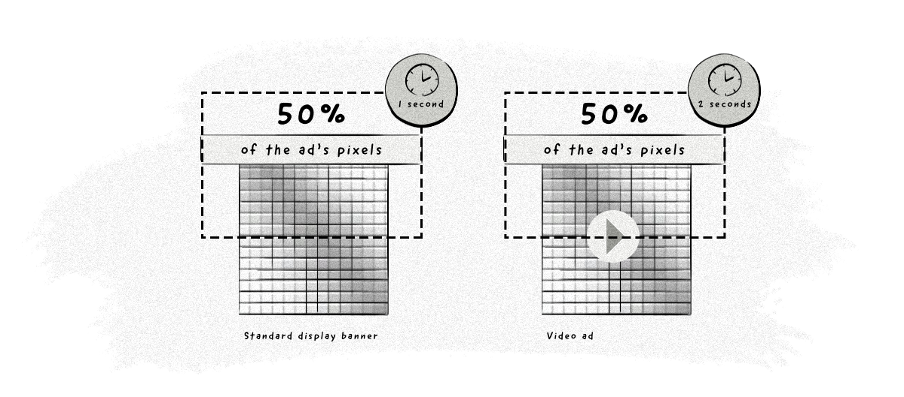

+++
title = "Viewable impression | Просматриваемый показ"
+++

# Viewable impression
## Просматриваемый показ

&nbsp;

Просматриваемый показ — это стандарт, согласно которому не менее 50% рекламного объявления должно быть видно на экране пользователя и оставаться видимым более 1 секунды. Этот стандарт был установлен Международным бюро рекламы ([IAB](/glossaries/glossary/internet-advertising-bureau-iab/)), чтобы помочь рекламодателям отличать [показы](/glossaries/glossary/impression-definition/), которые увидели реальные пользователи, от показов, которые могли быть показаны ботам.  

Однако не все показы становятся просматриваемыми. Вот несколько причин, почему реклама может быть показана, но не считается просматриваемой:  

- Пользователь слишком быстро покидает страницу, и показ не успевает засчитаться.  
- Пользователь видит менее 50% объявления.  
- Пользователь использует блокировщик рекламы (ad-blocker).  
- Страницу посещает бот, а не реальный человек.  
- Пользователь открывает страницу в браузере, который не поддерживает показ рекламы.  
- Устройство пользователя отключает показ рекламы.  

Просматриваемые показы — это важный показатель для рекламодателей, так как они помогают оценить реальную видимость рекламы и её потенциальное воздействие на аудиторию.