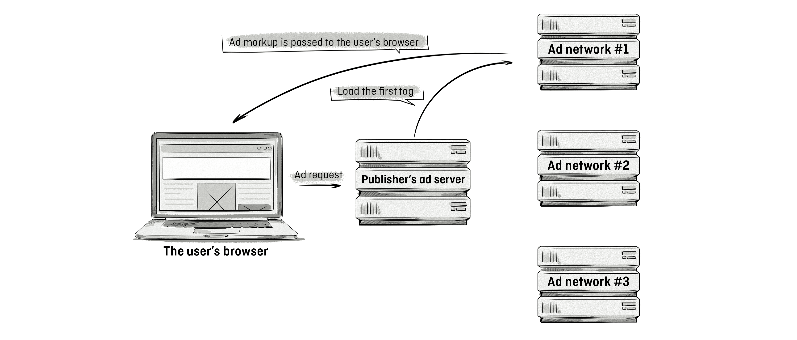

+++
title = "Waterfalling | Водопадная модель"
+++

# Waterfalling
## Водопадная модель

&nbsp;

Это процесс, который издатели ([publishers](/glossaries/glossary/publisher/)) используют для продажи всего оставшегося рекламного инвентаря ([remnant inventory](/glossaries/glossary/remnant-inventory/)).  

Водопадная модель применяется, когда издатель не смог продать свои премиальные рекламные места, которые обычно резервируются для прямых продаж через внутренний отдел продаж издателя и рекламодателей.  

Название "водопадная модель" происходит от последовательного процесса продажи инвентаря: источники спроса (demand sources) подключаются один за другим, как ступени водопада. Например, сначала инвентарь предлагается через прямые сделки, затем через частные рынки (PMP), а потом через открытые аукционы (Open RTB).  

Этот метод позволяет издателям максимизировать доход от оставшегося инвентаря, даже если он не был продан на более выгодных условиях.  

Водопадная модель — это как "страховка" для издателей, которая помогает им монетизировать каждый доступный рекламный слот, минимизируя потери.

